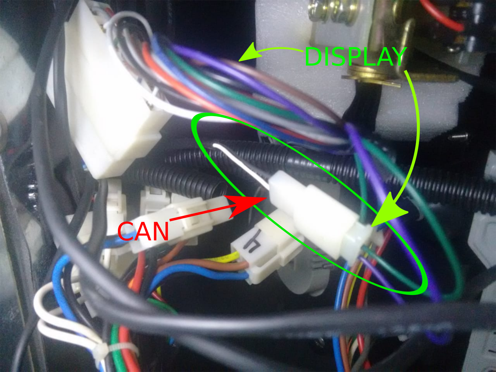

# ojEcoTech4 velocity and gear

Para acessar o barramento CAN do EcoTech4, levante o barramento can (precisa do CANable):

Para versão atualizada do CANable:
sudo ip link set can0 type can bitrate 250000

Para versão antiga:
 sudo slcand -o -c -s5 /dev/ttyACM0 can0 

 sudo ifconfig can0 up

As mensagens publicadas estão disponíveis em:
Resultados_da_analise_da_porta_CAN_SARA.xlsx

Os fios para acessar a CAN são os dois que estão no conector separados conectado ao Display do Painel, fios preto (CAN LOW) e branco (CAN HI)
As cores que vem da can do controlador não seguem um padrão

Na Sara 1 foi identificado as cores são as que vem do inversor

Na Sara 2 foi identificado as cores são as que vão para o display

