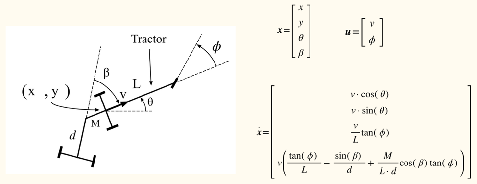

# libtrailer_nlp
The tractor-trailer vehicle trajectory planning problem is formulated as an optimal control problem, which aims to minimize the total trajectory execution time, subject to the kinematic constraints of multi-articulated vehicles and boundary conditions.




## Setup

- The easiest way to install CASADI C++ API with IPOPT

```
pip3 install casadi==3.5.5
```

- Add the following lines to your bash profile

```
#offroad_planner
export CASADI_DIR=$(/usr/bin/env python3 -c "import casadi; print(casadi.__path__[0])")
export LD_LIBRARY_PATH=$CASADI_DIR:$LD_LIBRARY_PATH
```


## Running the Test Case

This test case evaluates the trajectory planning for a tractor configured with two semi-trailers and one dolly (A-double / B-double variant setup). It validates the vehicle's kinematics and optimal control constraints under a multi-articulated configuration.

Before running the test case, ensure you have completed the Setup section.

1. Extract Geodata

The configuration requires the map data to be unpacked. Navigate to the asset directory and extract the archive:

```
cd $CARMEN_HOME/bin/axor3344-2_arcelor
```
```
tar -xvzf geodata.tar.gz
```
2. Start the Central Module

Open terminal, navigate to the binary directory, and launch the central communication module:

```
cd $CARMEN_HOME/bin
```
```
./central
```
3. Launch Process Control

Open a second terminal, navigate to the same binary directory, and run the process with the vehicle configuration:

```
cd $CARMEN_HOME/bin
```
```
./proccontrol axor3344-2_arcelor/process-navigate_axor3344_sensorbox-6.ini 

```