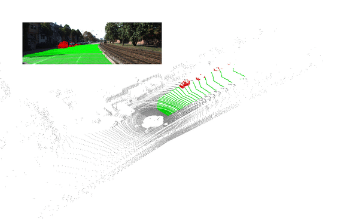
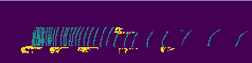
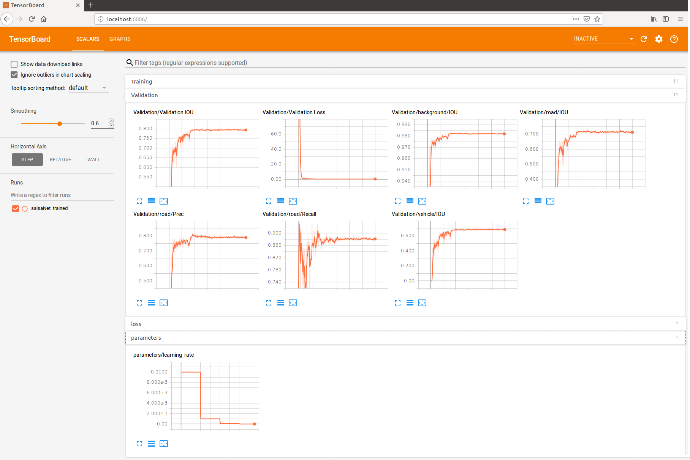

## _SalsaNet_: Fast Road and Vehicle Segmentation in LiDAR Point Clouds for Autonomous Driving

By Eren Erdal Aksoy, Saimir Baci, and Selcuk Cavdar

This repository contains a tensorflow implementation of “SemAntic Lidar data SegmentAtion Network”, i.e. SalsaNet, which has an encoder-decoder architecture to segment the road, i.e. drivable free-space, and vehicles in the scene by employing the Bird-Eye-View (BEV) image projection of 3D LiDAR point clouds.


<p align="center">
    
</p>
 
This gif animation is showing some qualitative results generated by SalsaNet. 
Note that the corresponding camera images on the top left are only for visualization purposes and have not been used in the training. 
The dark- and light-gray points in the point cloud represent points that are inside and outside the region-of-interest, respectively. 
The green and red points indicate road and vehicle segments.

Please see the high-resolution video showing more qualitative results on various KITTI scenarios: https://youtu.be/grKnW-uGIys 

Fore more information, please see our paper: https://arxiv.org/pdf/1909.08291.pdf

To cite our work, please use the following entry:

    @article{salsanet2019,
        title={SalsaNet: Fast Road and Vehicle Segmentation in LiDAR Point Clouds for Autonomous Driving},
        author={Aksoy, Eren Erdal and  Baci, Saimir and Cavdar, Selcuk},
        journal={CoRR}, 
        year={2019},
        url={http://arxiv.org/abs/1909.08291},
        archivePrefix={arXiv},
        eprint={1909.08291},
    } 

## Data
<ul>
  <li> Annotated training and validation data in BEV format (232 MB) is available [link](https://www.dropbox.com/s/66x2ktbxpico7ms/salsaNet_bev.zip?dl=0).</li> 
  <li> Annotated point cloud data (16.58 GB) is also available [link](https://www.dropbox.com/s/i4kdtyhe2b6jj6e/SalsaNet_LabeledPointCloud.zip?dl=0).</li> 
</ul>

## Installation:

The instructions are tested on Ubuntu 16.04 with python 3.5 and tensorflow 1.9.0 with GPU support. 
- Clone the SalsaNet repo:
    ```Shell
    git clone https://gitlab.com/aksoyeren/salsanet.git
    ```

- Setup a virtual environment:
    1. Create the virtual environment using Python3
        ```Shell
        virtualenv --system-site-packages -p python3 ./virtEnv3
        ```

    2. Activate the virtual environment
        ```Shell
        source ./virtEnv3/bin/activate
        ```

- Use pip to install required Python packages:
    ```Shell
    pip install -r requirements.txt
    ```


## Training and Testing:

After downloading the data provided above, store them under the folder /data. You can change the data path and gpu id number in the configuration file (/script/config.py).

- To train with the predefined parameters in the config file:
    ```Shell
    cd scripts
    python train.py 
    ```
- To test a BEV image:
    ```Shell
    cd scripts
    python test.py 
    ```
Note that the current test script is using the already trained SalsaNet model provided under /salsanet/logs/salsaNet_trained/model.chk-300. 
Just change the test script to be able use your own trained model.
You can also use a labeled point cloud (e.g. the one given above) to test SalsaNet. Just uncomment the respective line in /scripts/test.py
Predicted results will be shown as an image given below, where yelow and green colors respectively represent predicted vehicle and road segments in the bird-eye-view format.

<p align="center">
    
</p>


## Hints:
- Each training is saved in a log file named with a unique timestamp under /logs. By using the item "cfg.log_name" in the config file, you can add a more descriptive tag name to the log file if needed. For instance:  cfg.log_name= "withNewLoss". 
- In the automatically created   log file, there exists a file called "net_parameters.txt" summarizing all network parameters used for training.

## Results:

- Training process can be displayed using tensorboard.
    ```Shell
    tensorboard --logdir=./salsanet/logs/
    ```
When you navigate your web browser to localhost:6006, you will see the tensorboard output which looks like this: 
<p align="center">
    
</p>


