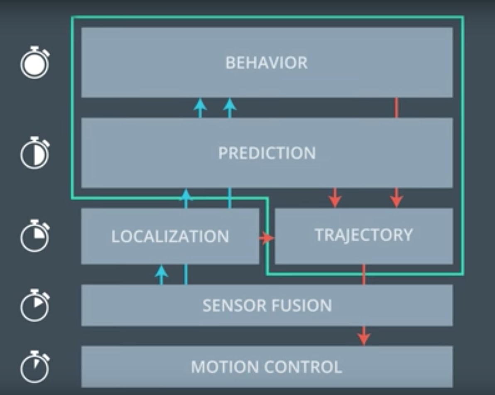
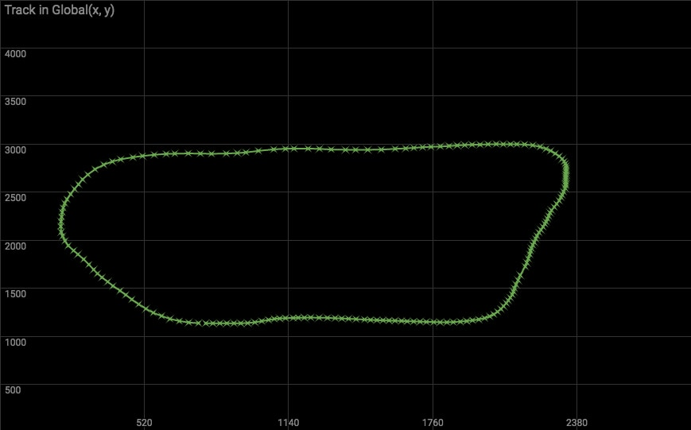

# Path Planning

## Introduction
A Path Planner's objective is to create a safe path for a self driving vehicle to follow. Path planning is comprised of the behavior planner taking in predictions of nearby cars, requesting a state change and generating a trajectory using the predictions. Path planning is done by the behavior control unit(green box) in the image below.

<p align="center">
   
</p>
<p align="center">
   <i>Figure 1: Behavior Control</i>
</p>

Some components of the behavior control unit run at a higher frequency than others as shown in the figure above. The output of the behavior control unit is a safe, feasible, legal and efficient trajectory.

## Project
The goal of this project is to create a trajectory for the car to follow in a simulated environment. The environment being a simulated track. Below is the image of the track(created from the way points data provided).

<p align="center">
   
</p>
<p align="center">
   <i>Figure 2: Track</i>
</p>

The track is 6945.554 meters around (about 4.32 miles) with a speed limit of 50mph. Inside `data/highway_map.csv` there is a list of waypoints that go all the way around the track. The track contains a total of 181 waypoints, with the last waypoint mapping back around to the first. Each waypoint has an (x,y) global map position, and a Frenet s value and Frenet d unit normal vector (split up into the x component, and the y component).

### Implementation
Below is the directory structure of this repository.

```
root
|   CMakeLists.txt
|   install-mac.sh
|   install-ubuntu.sh
|   README.md
|
|___data
|   |___images
|   |___highway_map.csv
|   
|___src
    |   Eigen-3.3
    |   helper.h
    |   json.hpp
    |   main.cpp
    |   spline.h
```

The main logic is the helper functions in helper.h with main.cpp executing the functions and getting appropriately spaced points for the car in the simulator to follow.

### Dependencies

* cmake >= 3.5
 * All OSes: [click here for installation instructions](https://cmake.org/install/)
* make >= 4.1
  * Linux: make is installed by default on most Linux distros
  * Mac: [install Xcode command line tools to get make](https://developer.apple.com/xcode/features/)
  * Windows: [Click here for installation instructions](http://gnuwin32.sourceforge.net/packages/make.htm)
* gcc/g++ >= 5.4
  * Linux: gcc / g++ is installed by default on most Linux distros
  * Mac: same deal as make - [install Xcode command line tools](https://developer.apple.com/xcode/features/)
  * Windows: recommend using [MinGW](http://www.mingw.org/)
* [uWebSockets](https://github.com/uWebSockets/uWebSockets)
  * Run either `install-mac.sh` or `install-ubuntu.sh`.
  * If you install from source, checkout to commit `e94b6e1`, i.e.
    ```
    git clone https://github.com/uWebSockets/uWebSockets
    cd uWebSockets
    git checkout e94b6e1
    ```

### Basic Build Instructions

1. Clone this repo.
2. Make a build directory: `mkdir build && cd build`
3. Compile: `cmake .. && make`
4. Run it: `./path_planning`.

## Discussion
In this project I started off with the ambition of using quintic polynomials for generating trajectories(based on Frenet coordinates) and minimizing jerks(sideway movement) using jerk minimizing techniques. Even though I had a pretty good working jerk minimizing model I definitely had issues with making it work for this project. After digging in a little as to why this approach was not working I came across Udacity's Q&A session which was really helpful in determining what might be wrong.

The result of not using any interoplation and relying on the Frenet transformation(which is what I was doing) with increasing s and constant d(based on time) is that during the waypoint corner transistions the car experiences a lot of acceleration, also the Frenet transformation isnt linear and has the greatest amount non-linearity at the corner cases which causes points to have unequal spacing and hence the erratic behavior being seen.

In the end I used a combination of Frenet coordinate transformations along with spline interoplation for smooth trajectory generation. Using the spline from spline.h is greatly able to help smooth out the path planning path.

> **NOTE:**
> This solution is heavily inspired by Udacity's working solution provided in their Q&A.

### Lane change(Behavior Planner)
The lane change(behavior planner) logic is simple, first I detect whether a lane change is required based on whether the car in it's current lane is getting close to the car infront of it. Once the flag is set which says that a lane change is required, a lane change is requested only if it is safe(collision free).

`line 125 in main.cpp: LaneChangePossible(...)`

`line 128 in main.cpp: ChangeLane(...)`

### Generate Way Points
Along with two way points from the previous path, only three widely spaced Frenet points are used with dynamic 'd'(based on the desired lane), and with 's' values spaced 30m for generating 3 more way points. This ensures that the car's projected path is nice and smooth and doesn't experience any max acceleration or jerk.

`line 136 in main.cpp: GenerateWayPoints(...)`

### Generating Path(Trajectory)
The 5 anchor way points(in local vehicle coordinate space) was used to create a spline. Then the spline was used for creating evenly spaced points(in global car-cordinates) where the car would transverse to each point every .02 seconds. One of the requirements for this project is to ensure that the maximum acceleration was less than 10m/s^2 at any point during the traverse. To do this the reference velocity was always incremented or decremented by some constant value that resulted in plus or minus 5 m/s^2 of acceleration.

`line 148 in main.cpp: CreateSpline(...)`

### Observed behavior
If there wasnt any cars in front of the ego vehicle then the reference speed was 49.5 MPH(slightly under the speed limit). If there was a car in front the ego vehicle, the ego vehicle would slow down and change to the appropriate lane only when feasible. The car is successfully able to do a full lap without any collision and I was able to see no incidents reported for close to 37 minutes in one of the runs.

### Simulator.
You can download the Term3 Simulator which contains the Path Planning Project from the [releases tab ([https://github.com/udacity/self-driving-car-sim/releases]()).

Here is the data provided from the Simulator to the C++ Program

#### Main car's localization Data (No Noise)

["x"] The car's x position in map coordinates

["y"] The car's y position in map coordinates

["s"] The car's s position in frenet coordinates

["d"] The car's d position in frenet coordinates

["yaw"] The car's yaw angle in the map

["speed"] The car's speed in MPH

#### Previous path data given to the Planner

> **NOTE**: Return the previous list but with processed points removed, can be a nice tool to show how far along
the path has processed since last time.

["previous\_path\_x"] The previous list of x points previously given to the simulator

["previous\_path\_y"] The previous list of y points previously given to the simulator

#### Previous path's end s and d values

["end\_path\_s"] The previous list's last point's frenet s value

["end\_path\_d"] The previous list's last point's frenet d value

#### Sensor Fusion Data, a list of all other car's attributes on the same side of the road. (No Noise)

["sensor_fusion"] A 2d vector of cars and then that car's [car's unique ID, car's x position in map coordinates, car's y position in map coordinates, car's x velocity in m/s, car's y velocity in m/s, car's s position in frenet coordinates, car's d position in frenet coordinates.

## Details

1. The car uses a perfect controller and will visit every (x,y) point it recieves in the list every .02 seconds. The units for the (x,y) points are in meters and the spacing of the points determines the speed of the car. The vector going from a point to the next point in the list dictates the angle of the car. Acceleration both in the tangential and normal directions is measured along with the jerk, the rate of change of total Acceleration. The (x,y) point paths that the planner recieves should not have a total acceleration that goes over 10 m/s^2, also the jerk should not go over 50 m/s^3. (NOTE: As this is BETA, these requirements might change. Also currently jerk is over a .02 second interval, it would probably be better to average total acceleration over 1 second and measure jerk from that.

2. There will be some latency between the simulator running and the path planner returning a path, with optimized code usually its not very long maybe just 1-3 time steps. During this delay the simulator will continue using points that it was last given, because of this its a good idea to store the last points you have used so you can have a smooth transition. previous_path_x, and previous_path_y can be helpful for this transition since they show the last points given to the simulator controller with the processed points already removed. You would either return a path that extends this previous path or make sure to create a new path that has a smooth transition with this last path.

## Final thoughts
Here is a link to the video of 2 laps of my path planner at work: [https://youtu.be/Fl7ybT17N_U](https://youtu.be/Fl7ybT17N_U)

This is a simplistic path planner with plenty of room for improvement in the following areas.

1. Behavior Planner: Have a ranking system to detect whether a lane switch or staying in the current lane is optimal

2. Controller: Incorporate a controller which follows the trajectory created

3. Better collision avoidance and detection

4. Optimize path to minimize acceleration and jerk spikes even further
