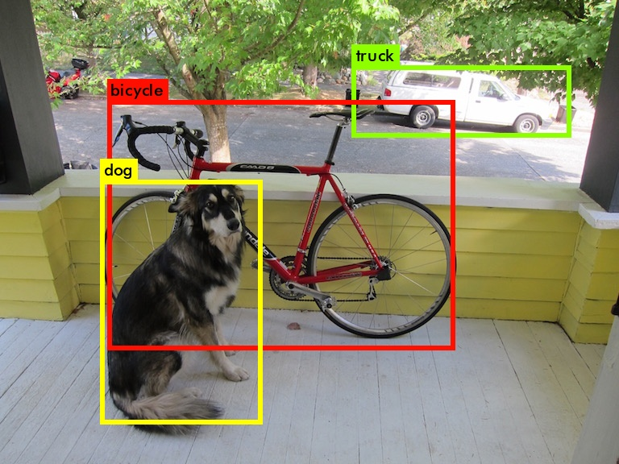

# Neural Car Detector

Detect vehicles using convolutional neural networks.

## Building
### Dependencies
To run this module you need either NVIDIA Caffe or Darknet.
Choose one of the two and proceed with installation.

####Option 1: Installing NVIDIA Caffe

Install nvcaffe dependencies:

``` bash
$ sudo apt-get update -y
$ sudo apt-get install cmake -y

# General dependencies
$ sudo apt-get install libprotobuf-dev libleveldb-dev libsnappy-dev \
libhdf5-serial-dev protobuf-compiler -y
$ sudo apt-get install --no-install-recommends libboost-all-dev -y

# BLAS
$ sudo apt-get install libatlas-base-dev -y

# Remaining Dependencies
$ sudo apt-get install libgflags-dev libgoogle-glog-dev liblmdb-dev -y

# Python Dependencies
$ sudo apt-get install python-dev python-numpy python-skimage python-protobuf -y
```
Install nvcaffe

``` bash
$ cd ~
$ git clone https://github.com/NVIDIA/caffe.git nvcaffe
$ cd nvcaffe
$ cp Makefile.config.example Makefile.config
```

If using gpu with CUDA capability lower than 3.0 change CUDA_ARCH lines, in Makefile.config to this

	CUDA_ARCH := -gencode arch=compute_20,code=sm_20 \
			-gencode arch=compute_20,code=sm_21 \
			-gencode arch=compute_50,code=sm_50 \
			-gencode arch=compute_52,code=sm_52 \
			-gencode arch=compute_60,code=sm_60 \
			-gencode arch=compute_61,code=sm_61 \
			-gencode arch=compute_61,code=compute_61

Uncomment the line, in Makefile.config

	WITH_PYTHON_LAYER := 1

If during compilation appear nvml.h error add the following line to Makefile.config:

	NO_NVML := 1
	
Then:

``` bash
$ make -j4
$ make pycaffe
```

Add the following lines to the end of .bashrc file

	# NVIDIA Caffe
	export NVCAFFE_HOME=~/nvcaffe 
	export PYTHONPATH=$NVCAFFE_HOME/python:/usr/lib/python2.7/dist-packages:$PYTHONPATH python
	export LD_LIBRARY_PATH=$NVCAFFE_HOME/build/lib:$LD_LIBRARY_PATH
	
Download caffemodel at: https://www.dropbox.com/s/075njerr4xvyz9u/snapshot_iter_21600.caffemodel?dl=0

	
#### Option 2: Darknet (YOLO)

Clone the repository:

``` bash
$ cd ~
$ git clone https://github.com/AlexeyAB/darknet.git
$ cd darknet
```
Some options need to be changed in the Makefile. Open it and set these:

* `GPU=1` to build with CUDA to accelerate by using GPU (CUDA should be in `/use/local/cuda`)
* `CUDNN=1` to build with cuDNN v5/v6 to accelerate training by using GPU (cuDNN should be in `/usr/local/cudnn`)
* `OPENCV=1` to build with OpenCV 3.x/2.4.x - allows to detect on video files and video streams from network cameras or web-cams
* `OPENMP=1` to build with OpenMP support to accelerate Yolo by using multi-core CPU
* `LIBSO=1` to build a library `darknet.so` and binary runable file `uselib` that uses this library.

Now just do `make` to compile the framework. Check if an file named darknet.so was created in the current directory.

Add the following lines to the end of .bashrc file

	# Darknet
	export DARKNET_HOME=~/darknet

The next step is to download the network weights and test if the detection is working. 

``` bash
$ wget -P data/ http://pjreddie.com/media/files/yolo.weights
$ ./darknet detect cfg/yolo.cfg data/yolo.weights data/dog.jpg
```
If everything is correct, you should now see this image:




#### Compiling and running the module

Before compiling the module, there are two flags in the makefile that control wich framework will be used. 
In order to select it, first open the Makefile:

``` bash
$ cd $CARMEN_HOME/src/neural_car_detector
$ gedit Makefile
```

The two flags of interest are `-DUSE_DETECTNET` and `-DUSE_YOLO_V2`.
Comment only the one you don't want to use. 
In the case you don't comment neither of them, detectnet have preference over darknet.

Compile the module doing an `make` at the current folder. To run it, you have to pass two parameters:

```bash
$ ./neural_car_detector <camera_number> <camera_side(0-left; 1-right)>
```