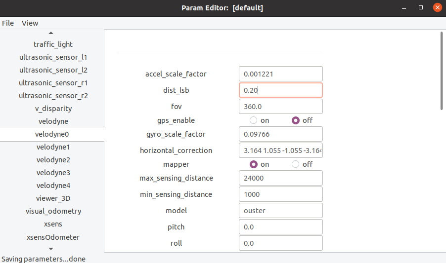

# param_daemon

## Índice

[1. Executando o módulo param_daemon](#1)<br>
[2. Conteúdo do arquivo de parâmetros (.ini)](#2)<br>
[3. Estrutura hierárquica com múltiplos arquivos de parâmetros](#3)<br>
[4. Utilitário param_edit](#4)<br>
[5. Utilização de parâmetros pelos módulos solicitantes](#5)<br>
[6. Subscrição para recebimento dinâmico de parâmetros modificados](#6)<br>

#1.
## Executando o módulo param_daemon

O módulo `param_daemon` é responsável por carregar, gerir e prover dinamicamente o conteúdo das variáveis paramétricas que são utilizadas sob demanda por todos os demais módulos do sistema, por meio de mensagens IPC. Portanto, ele deve ser o primeiro módulo a ser executado, logo após o IPC `central` inicializar.

Sintaxe da linha de comando:

```
param_daemon [-a] [-r <robot_name>] <ini_file> 
param_daemon [-a] -l <log_file>
```

Argumentos da linha de comando:

```
-a			--alphabetize		: lista os módulos e os parâmetros em ordem alfabética (isto facilita o uso do param_edit)
-r <robot_name>		--robot=<robot_name>	: utiliza o subconjunto de parâmetros de um robô específico (além de default [*] e [expert]) 
-l <log_file>		--log=<log_file>	: carrega os parâmetros que estão dentro de um arquivo de log (em vez de um arquivo ini)

```
Durante o processo de inicialização, o param_daemon analisa eventuais inconsistências no arquivo de parâmetros e informa quantos parâmetros foram carregados com sucesso:

```
$ param_daemon carmen.ini
[p2d8+]  [laseronly]  
The ini_file carmen.ini contains 2 robot definitions.
You must specify a robot name on the command line using --robot.
```

```
$ param_daemon -r p2d8+ carmen.ini
Loading parameters for robot p2d8+ using param file carmen.ini
On line 212: Error: parameter xsens_adapt does not have a value set
```

No exemplo a seguir, o parâmetro `visual_odometry_is_global_pos` foi declarado duas vezes com o mesmo valor `off`. O fato em si não significa um erro, porém um alerta para que se verifique se não houve alguma falha na digitação dos identificadores. O parâmetro `camera9_ip` também foi declarado duas vezes, porém com valores distintos; neste caso, prevalecerá o valor da última declaração. Isto também é motivo de alerta.

```
$ param_daemon carmen-ford-escape-sensorbox.ini
Loading parameters for default robot using param file carmen-ford-escape-sensorbox.ini
On line 2258: overwriting parameter camera9_ip from value = 192.168.1.15 to new value = 192.168.0.15
On line 3082: duplicated definition of parameter visual_odometry_is_global_pos = off
114 modules and 2003 parameters loaded
```

#2.
## Conteúdo do arquivo de parâmetros (.ini)

Cada seção do arquivo de parâmetros deve ser precedida por um identificador entre colchetes:

```
[*]		: indica que os parâmetros da seção são "default" válidos para qualquer tipo de robô
[expert]	: indica que os parâmetros da seção são válidos para qualquer tipo de robô e que só devem ser modificados por um expert
[<robot_name>]	: indica que os parâmetros da seção são específicos para um determinado tipo de robô
```

Cada linha dentro de uma seção define o valor de um parâmetro. O identificador de cada parâmetro tem o formato `<módulo>_<variável>`. No exemplo a seguir, temos a definição de valores para as variáveis `build_snapshot_map` e `velodyne_range_max` do módulo `mapper` e para a variável `vertical_correction` do `velodyne0`. O fato de o nome de um módulo compor o identificador de um parâmetro não significa que esse parâmetro seja exclusivo daquele módulo. Qualquer outro módulo do sistema pode utilizar qualquer parâmetro identificado com um nome de módulo distinto, tanto para consultar o seu valor, como também para modificar o valor, se necessário.

```
mapper_build_snapshot_map	off
mapper_velodyne_range_max	70.0	# expresso em metros
velodyne0_vertical_correction	16.611 16.084 15.557	# números reais separados por espaços
```

Todos os valores dos parâmetros são manipulados como strings dentro de `param_daemon`. Quando os módulos solicitantes enviam uma demanda de consulta desses valores, devem também informar a opção de conversão dos dados para números, usando as opções `INT` (inteiro), `DOUBLE` (real), `ONOFF` (inteiro 0 ou 1), ou se desejam receber o dado como string, usando a opção `STR`. As linhas iniciadas com `"#"` são ignoradas. Caso o caractere `"#"` esteja no meio de uma linha, todo o conteúdo a partir daí é ignorado, até o fim da linha. No exemplo acima, o valor de `velodyne_range_max` é `"70.0"` e o valor de `vertical_correction` é a string `"16.611 16.084 15.557"`. 

As linhas iniciadas com `"$"` são diretivas com propósitos especiais. A diretiva `$module` deve ser utilizada quando o nome do módulo contém o caractere `"_"`. No exemplo a seguir, o `param_daemon` reconherá que os nomes das duas variáveis são `following_lane_planner` e `parking_planner`, do módulo `behavior_selector`. Caso não fosse utilizada a diretiva `$module`, o `param_daemon` identificaria de modo inapropriado as variáveis `selector_following_lane_planner` e `selector_parking_planner` pertencentes ao módulo `behavior`. Isso é importante para a funcionalidade do utilitário `param_edit`. 

```
$module behavior_selector
behavior_selector_following_lane_planner	0
behavior_selector_parking_planner		1
$module		# se a diretiva não especificar um nome de módulo, o param_daemon assume que os nomes dos módulos não contêm o caractere _
```

#3.
## Estrutura hierárquica com múltiplos arquivos de parâmetros

Múltiplos arquivos de parâmetros pode ser estruturados hierarquicamente, utilizando a diretiva `$include`. No exemplo a seguir, basta informar o nome do arquivo `param_master.ini` como argumento para o `param_daemon`, e serão carregados ao todo 12 parâmetros, sendo 5 contidos no próprio arquivo `param_master.ini`, 3 contidos no arquivo `param_delta.ini`, 2 contidos no arquivo `param_gamma.ini`, e 2 contidos no arquivo `param_omega.ini`. Os arquivos `param_delta.ini` e `param_gamma.ini` são inseridos indiretamente, no nível 2 de aninhamento, a partir do arquivo `param_alpha.ini`.

Os arquivos de parâmetros inseridos a partir da diretiva `$include` podem ser referenciados por caminhos absolutos ou relativos. Caso seja utilizado um caminho relativo, o `param_daemon` assume como padrão o diretório onde está localizado o próprio arquivo que invocou o `$include`. A diretiva `$path` é utilizada para alterar o caminho padrão onde serão buscados os arquivos inseridos pelas diretivas `$include`. Da mesma forma, o caminho definido por `$path` pode ter uma referência absoluta ou relativa ao diretório onde está localizado o próprio arquivo.

```
# Arquivo param_master.ini
modulo1_variavel1		valor11
modulo1_variavel2		valor12
modulo1_variavel3		valor13
$path $HOME/params
$include param_alpha.ini
modulo2_variavel1		valor21
modulo2_variavel2		valor22
$include param_omega.ini
$path		# se a diretiva não especificar um caminho, o param_daemon assume o caminho padrão
```

```
# Arquivo $HOME/params/param_alpha.ini
$include param_delta.ini
$include param_gamma.ini
```

```
# Arquivo $HOME/params/param_delta.ini
delta_variavel1		d1
delta_variavel2		d2
delta_variavel3		d2
```

```
# Arquivo $HOME/params/param_gamma.ini
gamma_variavel1		g1
gamma_variavel2		g2
```

```
# Arquivo $HOME/params/param_omega.ini
omega_variavel1		o1
omega_variavel2		o2
```

Mais exemplos podem ser encontrados no diretório [src/param_daemon/examples](./examples/README.md).

#4.
## Utilitário param_edit

Uma vez que o módulo `param_daemon` esteja em execução, o programa utilitário `param_edit` pode ser utilizado para visualizar o conteúdo dos parâmetros carregados na memória de trabalho do `param_daemon`. Pode também ser utilizado para modificar dinamicamente esses valores e, opcionalmente, salvar o conteúdo modificado de todos os parâmetros, no mesmo arquivo `.ini` que foi utilizado pelo `param_daemon`, ou em um novo arquivo.

O `param_edit` mostra uma tela inicial contendo no quadro à esquerda a relação de módulos encontrados no `param_daemon`, e no quadro à direita a relação de parâmetros do módulo que estiver selecionado. A princípio, o `param_edit` não exibe os parâmetros da seção `[expert]`, somente os das seções `[*]` e do `[<robot_name>]` específico, se houver. Para exibir os parâmetros da seção `[expert]`, selecione a opção no menu suspenso: `View > Expert Params`. O `param_edit` colocará uma linha horizontal no quadro à direita da tela, separando na parte superior os parâmetros das seções `[*]` e `[<robot_name>]` específico, e na parte inferior os parâmetros da seção `[expert]` do módulo selecionado.

A seguir um exemplo de tela do utilitário `param_edit`:<br><br> 

Por padrão, o valor de cada parâmetro é colocado numa caixa de texto editável, com exceção dos parâmetros do tipo `ONOFF`, que são exibidos como botões de seleção. Pode-se modificar o valor de cada parâmetro, na sua respectiva caixa de texto ou botão. Quando se digita a tecla `Enter`, todos os valores são enviados via mensagens IPC para que o `param_daemon` os atualize em sua memória de trabalho. A seguinte mensagem é exibida no rodapé da tela: `"Saving parameters... done"`. No sentido inverso, se o valor de um parâmetro for atualizado em outro programa e comunicado via mensagem IPC, o `param_edit` atualiza o conteúdo exibido nos campos de sua tela, mostrando a seguinte mensagem no rodapé: `"Parameter changed: <nome_parametro> = <valor>"`.

Para salvar o conteúdo atualizado de todos os parâmetros em um arquivo `.ini`, selecione a opção no menu suspenso: `File > Save ini`. Será exibida uma nova janela de diálogo para que seja selecionado o diretório e informado o nome do arquivo que será salvo. Por padrão, o diretório e o nome são os mesmos do arquivo `.ini` que foi utilizado pelo `param_daemon` para carregamento dos parâmetros, mas também pode-se informar um novo arquivo. Durante o processo de salva em arquivo, o `param_edit` respeita toda a estrutura hierárquica de múltiplos arquivos de parâmetros, se houver. Dessa forma, se um parâmetro originalmente estiver dentro de um arquivo que foi inserido por meio de uma diretiva `$include`, durante o processo de salva o parâmetro será gravado no mesmo arquivo que doi inserido, e não no arquivo `.ini` principal.

#5.
## Utilização de parâmetros pelos módulos solicitantes

Há diversas funções e mensagens IPC disponíveis para serem usadas por qualquer módulo solicitante para fazer interface com o módulo `param_daemon`.


#6.
## Subscrição para recebimento dinâmico de parâmetros modificados

(sem interromper a execução)

1. Verifique no programa do módulo desejado, todas as chamadas à função "carmen_param_install_params". 
   Geralmente isto ocorre dentro da função "read_parameters" ou alguma semelhante.
   O terceiro argumento da função "carmen_param_install_params" é um vetor de struct "carmen_param_t".
   Exemplo:
      carmen_param_t param_list[] =
      {
         {(char *) "mapper", (char *) "velodyne",       CARMEN_PARAM_ONOFF,  &sensors_params[0].alive,                  0, NULL},
         {(char *) "mapper", (char *) "velodyne_locc",  CARMEN_PARAM_DOUBLE, &sensors_params[0].log_odds.log_odds_occ,  0, NULL},
         {(char *) "mapper", (char *) "velodyne_lfree", CARMEN_PARAM_DOUBLE, &sensors_params[0].log_odds.log_odds_free, 0, NULL},
         {(char *) "mapper", (char *) "velodyne_l0",    CARMEN_PARAM_DOUBLE, &sensors_params[0].log_odds.log_odds_l0,   0, NULL},
         {(char *) "mapper", (char *) "velodyne_unexpeted_delta_range_sigma", CARMEN_PARAM_DOUBLE, &sensors_params[0].unexpeted_delta_range_sigma, 0, NULL},
      };
   Cada elemento deste vetor corresponde a um parâmetro que será lido do carmen.ini. 
   Juntando-se o conteúdo das duas primeiras colunas, temos o nome do parâmetro (p.ex.: "mapper_velodyne").
   NOTA: O nome do módulo que aparece na primeira coluna não pode conter sublinhado (_). Se contiver, transfira o restante do nome para a segunda coluna.
         Por exemplo, em vez de:
         {(char *) "behavior_selector", (char *) "change_goal_distance", CARMEN_PARAM_DOUBLE, &change_goal_distance, 0, NULL},
	 Utilize:
         {(char *) "behavior", (char *) "selector_change_goal_distance", CARMEN_PARAM_DOUBLE, &change_goal_distance, 0, NULL},
   A terceira coluna indica o tipo de valor que será lido: INT (inteiro), DOUBLE (ponto flutuante), ONOFF (1 ou 0 inteiro), STR (caracteres), FILE ou DIR.
   A quarta coluna indica o ponteiro da variável que receberá o valor lido. Preferencialmente deve-se utilizar variável global.
   A quinta coluna indica se a variável será mod	ificada dinamicamente no programa. Coloque valor 1 caso queira habilitar isto.
   A sexta coluna opcionalmente indica uma função "handler" que será acionada quando o IPC central receber a modificação dinâmica do parâmetro.
   A função "handler" é necessária quando há algum procedimento complementar de inicialização logo após a chamada à função "carmen_param_install_params".
   Nos demais casos, basta colocar o valor 1 na quinta coluna e NULL na sexta coluna e as modificações dinâmicas serão ativadas.  
   Por exemplo, suponha que um parâmetro esteja expresso no carmen.ini em graus (0 a 360) mas o programa opere com valores em radianos.
   Neste caso deve-se criar um handler que transforme o parâmetro lido, de graus para radianos.
   Como regra geral, toda modificação de conteúdo de parâmetros que é feita imediatamente após a chamada à função "carmen_param_install_params", 
   deve ser tratada em handlers, caso os parâmetros possam ser modificados dinamicamente.
   Um exemplo de implementação de handler está nas funções "get_alive_sensors" e "sensors_params_handler" no programa "mapper_main.cpp".
   
2. Com o IPC central e o módulo "param_daemon" em execução, para modificar dinamicamente os parâmetros de carmen.ini, execute o programa "param_edit".
   Este programa abre uma janela com o título "Param Editor".
   No quadro à esquerda da janela, selecione o módulo desejado.
   NOTA: Se não aparecer nada no quadro à direita da janela, clique no menu superior "View > Expert Params"
   No quadro à direita da janela, selecione o parâmetro desejado e modifique o seu valor, seguido pela tecla "Enter".
   Aparecerá a mensagem no rodapé da janela: "Saving parameters... done".
   Ao final, caso deseje salvar permanentemente em arquivo os dados que foram alterados dinamicamente, clique no menu superior "File > Save ini".
   Aparecerá a mensagem no rodapé da janela: "Saving <arquivo.ini>... done".
   