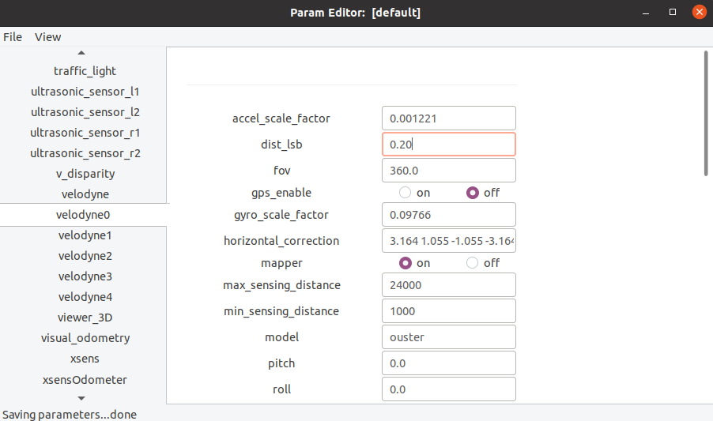

# param_daemon

## Índice

[1. Execução do módulo param_daemon](#1)<br>
[2. Conteúdo do arquivo de parâmetros (.ini)](#2)<br>
[3. Estrutura hierárquica com múltiplos arquivos de parâmetros](#3)<br>
[4. Utilitário param_edit para consulta e modificação dinâmica de parâmetros](#4)<br>
[5. Utilização de parâmetros pelos demais módulos do sistema](#5)<br>
[6. Subscrição para recebimento dinâmico de parâmetros modificados](#6)<br>

#1.
## Execução do módulo param_daemon

O módulo `param_daemon` é responsável por carregar, gerir e prover dinamicamente, por meio de mensagens IPC, o conteúdo das variáveis paramétricas que são utilizadas sob demanda por todos os demais módulos do sistema. Por isso, ele deve ser o primeiro módulo a ser executado, logo após o módulo IPC `central` inicializar.

Sintaxe da linha de comando:

```
param_daemon [-a] [-r <robot_name>] <ini_file> 
param_daemon [-a] -l <log_file>
```

Argumentos da linha de comando:

```
-a			--alphabetize		: lista os módulos e os parâmetros em ordem alfabética (isto ajuda o utilitário param_edit)
-r <robot_name>		--robot=<robot_name>	: utiliza o subconjunto de parâmetros de um robô específico (além de default [*] e [expert]) 
-l <log_file>		--log=<log_file>	: carrega os parâmetros que estão dentro de um arquivo de log (em vez de um arquivo ini)

```
Durante o processo de inicialização, `param_daemon` analisa eventuais inconsistências no arquivo de parâmetros e informa quantos parâmetros foram carregados com sucesso:

```
$ param_daemon carmen.ini
[p2d8+]  [laseronly]  
The ini_file carmen.ini contains 2 robot definitions.
You must specify a robot name on the command line using --robot.
```

```
$ param_daemon -r p2d8+ carmen.ini
Loading parameters for robot p2d8+ using param file carmen.ini
On line 212: Error: parameter xsens_adapt does not have a value set
```

No exemplo a seguir, o parâmetro `visual_odometry_is_global_pos` foi declarado duas vezes com o mesmo valor `off`. O fato em si não representa um erro fatal, porém aciona um alerta para que seja verificado se houve alguma falha na digitação dos identificadores. O parâmetro `camera9_ip` também foi declarado duas vezes, porém com dois valores distintos; neste caso, prevalecerá o valor da última declaração. Isto também é motivo de alerta.

```
$ param_daemon carmen-ford-escape-sensorbox.ini
Loading parameters for default robot using param file carmen-ford-escape-sensorbox.ini
On line 2258: overwriting parameter camera9_ip from value = 192.168.1.15 to new value = 192.168.0.15
On line 3082: duplicated definition of parameter visual_odometry_is_global_pos = off
114 modules and 2003 parameters loaded
```

#2.
## Conteúdo do arquivo de parâmetros (.ini)

Cada seção do arquivo de parâmetros deve ser precedida por um identificador entre colchetes:

```
[*]		: indica que os parâmetros da seção são "default" válidos para qualquer tipo de robô
[expert]	: indica que os parâmetros da seção são válidos para qualquer tipo de robô e que só devem ser modificados por um expert
[<robot_name>]	: indica que os parâmetros da seção são específicos para um determinado tipo de robô
```

Cada linha dentro de uma seção define o valor de um parâmetro. O identificador de cada parâmetro tem o formato `<módulo>_<variável>`. No exemplo a seguir, temos a definição de valores para as variáveis `build_snapshot_map` e `velodyne_range_max` do módulo `mapper` e para a variável `vertical_correction` do `velodyne0`. O fato de o nome de um módulo compor o identificador de um parâmetro não significa que esse parâmetro seja exclusivo daquele módulo. Qualquer outro módulo do sistema pode utilizar qualquer parâmetro identificado com um nome de módulo distinto, tanto para consultar o seu valor, como também para modificar o valor, se necessário.

```
mapper_build_snapshot_map	off
mapper_velodyne_range_max	70.0	# expresso em metros
velodyne0_vertical_correction	16.611 16.084 15.557	# números reais separados por espaços
```

Todos os valores dos parâmetros são manipulados como strings dentro de `param_daemon`. Quando os módulos solicitantes enviam uma demanda de consulta desses valores, devem também informar a opção de conversão dos dados para números, usando as opções `INT` (inteiro), `DOUBLE` (real), `ONOFF` (inteiro 0 ou 1), ou se desejam receber o dado como string, usando a opção `STR`. As linhas iniciadas com `'#'` são ignoradas. Caso o caractere `'#'` esteja no meio de uma linha, todo o conteúdo a partir daí é ignorado, até o fim da linha. No exemplo acima, o valor de `velodyne_range_max` é `"70.0"` e o valor de `vertical_correction` é a string `"16.611 16.084 15.557"`. 

As linhas iniciadas com `'$'` são diretivas com propósitos especiais. A diretiva `$module` deve ser utilizada quando o nome do módulo contém o caractere `'_'`. No exemplo a seguir, o `param_daemon` reconherá que os nomes das duas variáveis são `following_lane_planner` e `parking_planner`, do módulo `behavior_selector`. Caso não fosse utilizada a diretiva `$module`, o `param_daemon` identificaria de modo inapropriado as variáveis `selector_following_lane_planner` e `selector_parking_planner` pertencentes ao módulo `behavior`. Isso é importante para a funcionalidade do utilitário `param_edit`. 

```
$module behavior_selector
behavior_selector_following_lane_planner	0
behavior_selector_parking_planner		1
$module		# se a diretiva não especificar um nome de módulo, o param_daemon assume que os nomes dos módulos não contêm o caractere '_'
```

#3.
## Estrutura hierárquica com múltiplos arquivos de parâmetros

Múltiplos arquivos de parâmetros pode ser estruturados hierarquicamente, utilizando a diretiva `$include`. No exemplo a seguir, basta informar o nome do arquivo `param_master.ini` como argumento para o `param_daemon`, e serão carregados ao todo 12 parâmetros, sendo 5 contidos no próprio arquivo `param_master.ini`, 3 contidos no arquivo `param_delta.ini`, 2 contidos no arquivo `param_gamma.ini`, e 2 contidos no arquivo `param_omega.ini`. Os arquivos `param_delta.ini` e `param_gamma.ini` são inseridos indiretamente, no nível 2 de aninhamento, a partir do arquivo `param_alpha.ini`. Pode haver múltiplos níveis de aninhamento.

Os arquivos de parâmetros inseridos a partir da diretiva `$include` podem ser referenciados por caminhos absolutos ou relativos. Caso seja utilizado um caminho relativo, o `param_daemon` assume como padrão o diretório onde está localizado o próprio arquivo que invocou o `$include`. A diretiva `$path` é utilizada para alterar o caminho padrão onde serão buscados os arquivos inseridos pelas diretivas `$include`. Da mesma forma, o caminho definido por `$path` pode ter uma referência absoluta ou relativa ao diretório onde está localizado o próprio arquivo.

```
# Arquivo param_master.ini
modulo1_variavel1		valor11
modulo1_variavel2		valor12
modulo1_variavel3		valor13
$path $HOME/params
$include param_alpha.ini
modulo2_variavel1		valor21
modulo2_variavel2		valor22
$include param_omega.ini
$path		# se a diretiva não especificar um caminho, o param_daemon assume o caminho padrão
```

```
# Arquivo $HOME/params/param_alpha.ini
$include param_delta.ini
$include param_gamma.ini
```

```
# Arquivo $HOME/params/param_delta.ini
delta_variavel1		d1
delta_variavel2		d2
delta_variavel3		d2
```

```
# Arquivo $HOME/params/param_gamma.ini
gamma_variavel1		g1
gamma_variavel2		g2
```

```
# Arquivo $HOME/params/param_omega.ini
omega_variavel1		o1
omega_variavel2		o2
```

Mais exemplos podem ser encontrados no diretório [src/param_daemon/examples](./examples/README.md).

#4.
## Utilitário param_edit para consulta e modificação dinâmica de parâmetros

Uma vez que o módulo `param_daemon` esteja em execução, o programa utilitário `param_edit` pode ser utilizado para visualizar o conteúdo dos parâmetros carregados na memória de trabalho do `param_daemon`. Pode também ser utilizado para modificar dinamicamente esses valores e, opcionalmente, salvar o conteúdo modificado de todos os parâmetros, em um arquivo `.ini`.

O `param_edit` mostra uma tela inicial contendo no quadro à esquerda a relação de módulos encontrados no `param_daemon`, e no quadro à direita a relação de parâmetros do módulo que estiver selecionado. A princípio, o `param_edit` não exibe os parâmetros da seção `[expert]`, somente os das seções `[*]` e do `[<robot_name>]` específico, se houver. Para exibir todos os parâmetros, inclusive os da seção `[expert]`, selecione a opção no menu suspenso: `View > Expert Params`. O `param_edit` colocará uma linha horizontal no quadro à direita da tela, separando na parte superior os parâmetros das seções `[*]` e `[<robot_name>]` específico, e na parte inferior os parâmetros da seção `[expert]` do módulo selecionado.

A seguir um exemplo de tela do utilitário `param_edit`:<br><br> 

Por padrão, o valor de cada parâmetro é colocado numa caixa de texto editável, com exceção dos parâmetros do tipo `ONOFF`, que são exibidos como botões de seleção. Pode-se modificar o valor de cada parâmetro, na sua respectiva caixa de texto ou botão. Quando se pressiona a tecla `Enter`, todos os valores são enviados via mensagens IPC para que o `param_daemon` os atualize em sua memória de trabalho. Igualmente, todos os demais módulos do sistema que subscreveram os parâmetros que foram modificados, serão notificados sobre os novos valores. A seguinte mensagem é exibida no rodapé da tela: `"Saving parameters... done"`. No sentido inverso, se o valor de um parâmetro for modificado por outro programa e comunicado via mensagem IPC, o `param_edit` atualiza o conteúdo exibido nos campos de sua tela, mostrando a seguinte mensagem no rodapé: `"Parameter changed: <nome_parametro> = <valor>"`.

Para salvar o conteúdo atualizado de todos os parâmetros em um arquivo `.ini`, selecione a opção no menu suspenso: `File > Save ini`. Será exibida uma nova janela de diálogo para que seja selecionado o diretório e informado o nome do arquivo que será salvo. Por padrão, o diretório e o nome são os mesmos do arquivo `.ini` que foi utilizado pelo `param_daemon` para carregamento dos parâmetros, mas também pode-se informar um novo arquivo. Aparecerá a mensagem no rodapé da tela: `"Saving <arquivo>... done"`.  Durante o processo de salva em arquivo, o `param_edit` respeita toda a estrutura hierárquica de múltiplos arquivos de parâmetros, se houver. Dessa forma, se um parâmetro originalmente estiver dentro de um arquivo que foi inserido por meio de uma diretiva `$include`, durante o processo de salva o parâmetro será gravado no mesmo arquivo inserido, e não no arquivo `.ini` principal.

#5.
## Utilização de parâmetros pelos demais módulos do sistema

Há diversas mensagens IPC e funções disponíveis para serem usadas por qualquer módulo do sistema, para fazer interface com o módulo `param_daemon`. Algumas funções tratam múltiplos parâmetros simultaneamente, enquanto outras tratam um parâmetro por vez. 

### Solicitação de consulta de uma lista com vários parâmetros

O meio mais prático de um módulo solicitar todos os valores de parâmetros desejados é por meio das seguintes funções de interface, que tratam múltiplos parâmetros simultaneamente:

```
void carmen_param_allow_unfound_variables(int new_value);
int carmen_param_install_params(int argc, char *argv[], carmen_param_p param_list, int num_items);
```

A lista de parâmetros é informada por meio de um vetor de elementos da estrutura `carmen_param_t`.

```
typedef struct {
  char *module;                           // <module>_<variable> compõem o identificador do parâmetro 
  char *variable;                         // 
  carmen_param_type_t type;               // Tipo de conversão de dado que deve ser feita para o valor do parâmetro: INT, DOUBLE, ONOFF, STR
  void *user_variable;                    // Ponteiro para a variável local ou global que receberá o valor convertido do parâmetro
  int subscribe;                          // Toda vez que outro módulo publicar uma modificação de valor desse parâmetro,
                                          //   a variável local (*user_variable) deve ser automaticamente atualizada? 0 (false) ou 1 (true)
  carmen_param_change_handler_t handler;  // Em caso de subscribe == 1, caso haja um handler (não nulo), esta função será chamada após
                                          //   (*user_variable) ser atualizada, com 3 argumentos: (char *module, char *variable, char *value)
} carmen_param_t, *carmen_param_p;
```

No exemplo abaixo, os parâmetros obrigatórios estão informados em `plist1` e os parâmetros opcionais em `plist2`. As chamadas à função `carmen_param_allow_unfound_variables` estabelecem o caráter obrigatório ou opcional. Se algum parâmetro obrigatório não for encontrado, ocorre erro fatal. Se o nome de um módulo for substituído pela palavra `"commandline"`, isto indica que o parâmetro será buscado no vetor `argv`, em vez do processo normal, em que os parâmetros são buscados na memória de trabalho de `param_daemon`. Nesse caso, os parâmetros em `argv` devem ser precedidos por um hífen, como por exemplo: `-speed` e `-text`. Preferencialmente, todas as variáveis locais ou globais que receberão os valores convertidos dos parâmetros devem ter valores default iniciais, como por exemplo: `g_window_width = 1000`. Os erros de conversão de dados (por exemplo, de STR para INT) são ignorados na memória de trabalho de `param_daemon`, mas são fatais quando `"commandline"` é usado.

```
int g_window_width = 1000, g_draw_path = 1;
double g_integrate_angle_deg = 0.0, g_integrate_angle_rad = 0.0, g_speed = 1.0;
char *g_map = (char *) "Costs", *g_text = (char *) "";

void
read_parameters(int argc, char *argv[])
{
	carmen_param_t plist1[] =
	{
		{(char *) "navigator_panel", (char *) "window_width",        CARMEN_PARAM_INT,    &g_window_width,        0, NULL},
		{(char *) "navigator_panel", (char *) "draw_path",           CARMEN_PARAM_ONOFF,  &g_draw_path            0, NULL},
		{(char *) "localize",        (char *) "integrate_angle_deg", CARMEN_PARAM_DOUBLE, &g_integrate_angle_deg, 0, NULL},
		{(char *) "navigator_panel", (char *) "map",                 CARMEN_PARAM_STR,    &g_map,                 0, NULL},
	};
	
	carmen_param_t plist2[] =
	{
		{(char *) "commandline", (char *) "speed", CARMEN_PARAM_DOUBLE, &g_speed, 0, NULL},
		{(char *) "commandline", (char *) "text",  CARMEN_PARAM_STR,    &g_text,  0, NULL},
	};
	
	carmen_param_allow_unfound_variables(0);
	carmen_param_install_params(argc, argv, plist1, sizeof(plist1) / sizeof(plist1[0]));
	
	carmen_param_allow_unfound_variables(1);
	carmen_param_install_params(argc, argv, plist2, sizeof(plist2) / sizeof(plist2[0]));
	
	g_integrate_angle_rad = carmen_degrees_to_radians(g_integrate_angle_deg);
}
```

### Solicitação de consulta ou atualização de um parâmetro individualmente

As funções de interface que tratam apenas um parâmetro por vez permitem consulta ou atualização de parâmetro na memória de trabalho de `param_daemon`.

Funções para consulta de um parâmetro:

```
void carmen_param_set_module(const char *new_module_name);  // Estabelece qual é o módulo que compõe o identificador do parâmetro
int carmen_param_get_int(const char *variable, int *return_value, int *expert);
int carmen_param_get_double(const char *variable, double *return_value, int *expert);
int carmen_param_get_onoff(const char *variable, int *return_value, int *expert);
int carmen_param_get_string(const char *variable, char **return_value, int *expert);
```

Funções para modificação de um parâmetro (ou criação de um novo parâmetro, caso ele não exista):

```
void carmen_param_set_module(const char *new_module_name);  // Estabelece qual é o módulo que compõe o identificador do parâmetro
int carmen_param_set_int(const char *variable, int new_value, int *return_value);
int carmen_param_set_double(const char *variable, double  new_value, double *return_value);
int carmen_param_set_onoff(const char *variable, int new_value, int *return_value);
int carmen_param_set_string(const char *variable, const char *new_value, char **return_value);
```

Por meio das funções `carmen_param_set_<type>`, um dado recebido na linha de comando, ou dinamicamente elaborado dentro de um módulo, pode ser publicado no `param_daemon`, deixando-o disponível para ser utilizado por quaisquer outros módulos do sistema.

#6.
## Subscrição para recebimento dinâmico de parâmetros modificados

A função `read_parameters` exemplificada na [Seção 5](#5) não está preparada para tratar modificações dinâmicas dos parâmetros lidos. Isto significa que, uma vez que o programa execute aquela função e leia os parâmetros desejados, esses valores permanecerão inalterados ao longo de toda a execução do programa. Diferentemente, há casos em que o comportamento desejado é que os parâmetros possam ser alterados dinamicamente (sem haver necessidade de reiniciar a execução do módulo), caso outros módulos tenham modificado esses parâmetros após o carregamento inicial, ou caso outro arquivo de parâmetros `.ini` seja posteriomente carregado no `param_daemon`. 

### Subscrição de uma lista com vários parâmetros

O código a seguir exemplifica o tratamento dinâmico de parâmetros modificados, a partir da subscrição da lista `plist1`, que contém 4 parâmetros. Em comparação com o exemplo da [Seção 5](#5), temos a modificação do argumento `subscribe = 1`, na quinta coluna da estrutura `carmen_param_t` no vetor `plist1`. Isto faz com que as variáveis `g_window_width`, `g_draw_path`, `g_integrate_angle_deg` e `g_map` sejam dinamicamente atualizadas, toda vez que algum módulo publicar uma modificação do conteúdo dos parâmetros correspondentes (`navigator_panel_window_width` e demais). Na parte final da função `read_parameters`, vemos que o valor de `g_integrate_angle_rad` é dependente do valor de `g_integrate_angle_deg`. Por este motivo, é necessário repetir esse pós-processamento toda vez que a variável `g_integrate_angle_deg` for modificada. Isso é realizado pela função handler `update_angle` que é passada como argumento na sexta coluna da estrutura `carmen_param_t` no vetor `plist1`.

```
int g_window_width = 1000, g_draw_path = 1;
double g_integrate_angle_deg = 0.0, g_integrate_angle_rad = 0.0, g_speed = 1.0;
char *g_map = (char *) "Costs", *g_text = (char *) "";

void
update_angle(char *module, char *variable, char *value)
{
	// Esta função é chamada após g_integrate_angle_deg ter sido atualizada por strtod(value)
	// A verificação de module e variable é útil quando esta função for utilizada por múltiplos subscribes

	if (strcmp(module, "localize") == 0 && strcmp(variable, "integrate_angle_deg") == 0)
		g_integrate_angle_rad = carmen_degrees_to_radians(g_integrate_angle_deg);
}

void
read_parameters(int argc, char *argv[])
{
	carmen_param_t plist1[] =
	{
		{(char *) "navigator_panel", (char *) "window_width",        CARMEN_PARAM_INT,    &g_window_width,        1, NULL},
		{(char *) "navigator_panel", (char *) "draw_path",           CARMEN_PARAM_ONOFF,  &g_draw_path            1, NULL},
		{(char *) "localize",        (char *) "integrate_angle_deg", CARMEN_PARAM_DOUBLE, &g_integrate_angle_deg, 1, update_angle},
		{(char *) "navigator_panel", (char *) "map",                 CARMEN_PARAM_STR,    &g_map,                 1, NULL},
	};
	
	carmen_param_t plist2[] =
	{
		{(char *) "commandline", (char *) "speed", CARMEN_PARAM_DOUBLE, &g_speed, 0, NULL},
		{(char *) "commandline", (char *) "text",  CARMEN_PARAM_STR,    &g_text,  0, NULL},
	};
	
	carmen_param_allow_unfound_variables(0);
	carmen_param_install_params(argc, argv, plist1, sizeof(plist1) / sizeof(plist1[0]));
	
	carmen_param_allow_unfound_variables(1);
	carmen_param_install_params(argc, argv, plist2, sizeof(plist2) / sizeof(plist2[0]));
	
	g_integrate_angle_rad = carmen_degrees_to_radians(g_integrate_angle_deg);
}
```

Um exemplo de implementação de handler está nas funções `carmen_mapper_get_alive_sensors` e `carmen_mapper_sensors_params_handler` no programa [mapper.cpp](../mapper/mapper.cpp).

### Subscrição de um parâmetro individualmente

Funções de interface para subscrição de um parâmetro individualmente:

```
void carmen_param_subscribe_int(char *module, char *variable, int *variable_address, carmen_param_change_handler_t handler);
void carmen_param_subscribe_double(char *module, char *variable, double *variable_address, carmen_param_change_handler_t handler);
void carmen_param_subscribe_onoff(char *module, char *variable, int *variable_address, carmen_param_change_handler_t handler);
void carmen_param_subscribe_string(char *module, char *variable, char **variable_address, carmen_param_change_handler_t handler);
```

Toda vez que o parâmetro `<module>_<variable>` for modificado dinamicamente e publicado por um módulo qualquer do sistema, o novo valor será automaticamente armazenado em `(*variable_address)` e haverá o pós-processamento da função `handler` (caso o ponteiro de handler não seja nulo).
