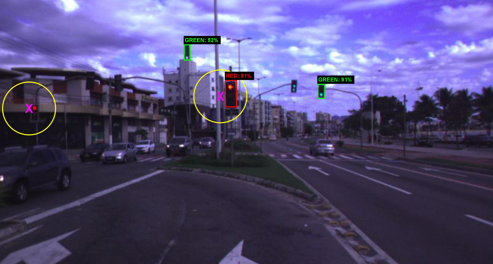

Traffic Light Recognition Using Deep Learning and Prior Maps for Autonomous Cars
================================================================================

Autonomous terrestrial vehicles must be capable
of perceiving traffic lights and recognizing their current states
to share the streets with human drivers. Most of the time,
human drivers can easily identify the relevant traffic lights. To
deal with this issue, a common solution for autonomous cars
is to integrate recognition with prior maps. However, additional
solution is required for the detection and recognition of the traffic
light. Deep learning techniques have showed great performance
and power of generalization including traffic related problems.
Motivated by the advances in deep learning, some recent works
leveraged some state-of-the-art deep detectors to locate (and
further recognize) traffic lights from 2D camera images. However,
none of them combine the power of the deep learning-based
detectors with prior maps to recognize the state of the relevant
traffic lights. Based on that, this work proposes to integrate the
power of deep learning-based detection with the prior maps used
by our car platform IARA (acronym for Intelligent Autonomous
Robotic Automobile) to recognize the relevant traffic lights of
predefined routes. The process is divided in two phases: an offline
phase for map construction and traffic lights annotation; and an
online phase for traffic light recognition and identification of the
relevant ones. The proposed system was evaluated on five test
cases (routes) in the city of Vitória, each case being composed
of a video sequence and a prior map with the relevant traffic
lights for the route. Results showed that the proposed technique
is able to correctly identify the relevant traffic light along the
trajectory.

[Link to the paper (published).](https://ieeexplore.ieee.org/document/8851927)
[Link to the paper (arXiv).](https://arxiv.org/abs/1906.11886)

<!--  -->

## Videos

The following video demonstrates the proposed system working offline (not in the car).

<!-- https://stackoverflow.com/a/16079387/4630320 -->
[](https://youtu.be/VhdLpuErJ8E)

## Trained Models

Datasets used for training:
 - DriveU Traffic Light Dataset (DTLD): https://www.uni-ulm.de/en/in/driveu/projects/driveu-traffic-light-dataset/
 - LISA Traffic Light Dataset (LISA-TLD): https://www.kaggle.com/mbornoe/lisa-traffic-light-dataset

We trained a [YOLOv3][yolo] model that can detect traffic lights and classify their state: red or yellow (in a single class); and green.
To run the inference using our trained model, you will need the following files:
 - Data (dummy): https://drive.google.com/open?id=1n14nQDpN_NAIn61JK5_EQYFJXPJM7Kai
 - Names: https://drive.google.com/open?id=1ZgUceNvhHm9XST0H_M_hi8hqk4wx9mI6
 - Cfg: https://drive.google.com/open?id=1dx6rKLPxnxu_YXzmsqr3D8IT5UTL_3Gu
 - Weights: https://drive.google.com/open?id=1CCbc-6FgCtXD2g_1jQfGdm0cWqfIwwbC

[yolo]: https://pjreddie.com/darknet/yolo/

After compiling [darknet] and downloading the previous files to the same place where the Darknet binary is, run the following command to see the results on your own images.

[darknet]: https://github.com/pjreddie/darknet

```bash
./darknet detector test dummy_nrg.data yolov3-nrgr-10000-const-lr-1e-4.cfg yolov3-nrgr-10000-const-lr-1e-4_15000.weights YOUR_IMAGE.png
# Or, for multiple images (file paths will be read from STDIN):
./darknet detector test dummy_nrg.data yolov3-nrgr-10000-const-lr-1e-4.cfg yolov3-nrgr-10000-const-lr-1e-4_15000.weights
```

While doing inference you can also pass the option `-thresh 0.2` to the binary in order to decrease its confidence threshold to 0.2, like we do in our paper.

## Usage Instructions

This module (`traffic_light_yolo`) was created as a solution for Traffic Light Recognition. It uses YOLOv3 and OpenCV's Random Forests.

Type `traffic_light_yolo --help` to get a summary of the available command line options:
  - `--camera_number` (**mandatory**): Which bumblebee camera will provide the images.
  - `--camera_side` (**mandatory**): Which side from the bumblebee should be used. Choose 0 for the left image, or 1 for the right one.
  - `--annotation_path` (**mandatory**): File with annotations of relevant traffic lights. The annotation format is the standard one, more on this down below.
  - `--yolo_cfg`: The configuration file for YOLOv3. It usually has the `.cfg` extension. (Default: `$CARMEN_HOME/data/traffic_light/yolov3/yolov3-tl-red-green.cfg`)
  - `--yolo_names`: File with the name of classes, one per line. It usually has the `.names` extension. (Default: `$CARMEN_HOME/data/traffic_light/yolov3/rg.names`)
  - `--yolo_weights`: File with YOLOv3's weights. `.weights` extension. (Default: `$CARMEN_HOME/data/traffic_light/yolov3/yolov3-tl-red-green.weights`)
  - `--yolo_thresh`: Only bounding boxes with score above this threshold will be used. (Default: `0.2`.)
  - `--rf_weights`: File with weights for the Random Forest classifier. (Default: `$CARMEN_HOME/data/traffic_light/random_forest/cv_rtrees_weights_tl_rgy.yml`)
  - `--rf_bgr`: Convert image to BGR before feeding it to the random forest model. (Default: `off`)
  - `--yolo_class_set`: A string that describes which classes can come from YOLO's predictions. It can be: `COCO`, the model was trained on COCO; `RG`, when it predicts red and green traffic lights; `RGY`, when it predicts red, green and yellow traffic lights. (Default: `RG`)
  - `--final_class_set`: Same as `--yolo_class_set`, but it describes the final classes used, i.e., after all predictions. (Default: `RGY`)
  - `--draw_fps`: Draw an FPS counter to the corner of the preview window. (Default: `off`)
  - `--draw_bbs`: Draw the bounding boxes predicted by YOLO. The color of the bounding box will be in accordance with the predicted state. (Default: `on`)
  - `--draw_text`: Draw the labels of bounding boxes, right above them. This is unnecessary if you are used to distinguishing the bounding boxes by color. (Default: `on`)
  - `--draw_text_background`: Draw a black background behind the bounding boxes' labels, for easier reading. (Default: `on`)
  - `--draw_close_tls`: Draw a red point where the relevant traffic lights are expected to be. (Only traffic lights within 100 meters) (Default: `on`)
  - `--draw_circle_threshold`: Draw yellow circumferences around the relevant traffic lights. The circumferences represent the search area for bounding boxes. If there are bounding box with center within the circumference, that which is closest to the center will be chosen to represent that traffic light. (Default: `on`)
  - `--draw_lidar_points`: Draw LiDAR rays projected onto the camera image. (Default: `off`)
  - `--draw_final_prediction`: Draw a circle at the bottom-right corner with the color of the final prediction. The final prediction is that which will be forwarded to the Behavior Selector. (Default: `on`)
  - `--run_yolo`: Disable/Enable YOLO. This can't be disabled if you want to run inference or annotate traffic light positions. Disabling YOLO can be useful for annotating the frames with `--print-gt-prep`. (Default: `on`)
  - `--run_random_forest`: Disable/Enable the RF. (Default: `off`)
  - `--compute_tl_poses`: Enable this if you want to annotate traffic lights. (Default: `off`)
  - `--print_final_prediction`: At each frame, print: the image's timestamp; the distance to the closest traffic light ahead of the vehicle; the final prediction. (Default: `off`)
  - `--print_gt_prep`: Same as `--print_final_prediction` but it doesn't print the final prediction. This is useful for annotating the frames. (Default: `off`)
  - `--display_resolution`: Resolution of the preview window. (Default: `640x480`)

As stated before, only three options are mandatory: `--camera_number`, `--camera_side` and `--annotation_path`. And these three can be provided as positional arguments in the command line, but the other ones can't. Here is an example of how to run the module with default parameters:

```bash
## Using the positional arguments format.
./traffic_light_yolo 3 1 "../data/rddf_annotation_dante_michelini-20181116-pista-esquerda.txt"
## Using the optional (named) arguments format.
./traffic_light_yolo --camera_number 3 --camera_side 1 --annotation_path "../data/rddf_annotation_dante_michelini-20181116-pista-esquerda.txt"
```

The format used in the annotation file is the standard format used in IARA. One annotation per line specifying their type, latitute, longitude, etc. Here is an example of the format:
```
# I don't remember what each column means exactly... But you know them, right?
# They are: latitute, longitude, height, orientation, type of annotation, etc.
RDDF_ANNOTATION_TYPE_TRAFFIC_LIGHT  8     0  -0.730  7757149.652916  -365619.661488  2.473163
RDDF_ANNOTATION_TYPE_TRAFFIC_LIGHT  8     0  -0.460  7757149.652916  -365619.661488  2.473163
```

**WARNING**: The annotation file that you specify with `--annotation_path` should contain only the traffic lights that are **RELEVANT** for the route that the car will follow. If you fail to meet this requirement, IARA will obey traffic lights that it should not.

Remember to download the files necessary for running the YOLOv3 model. You can find them at the links provided above.
The files for the random forest models have been committed to carmen_lcad's source, since they are very small. So there's no need for downloading them.

If you were willing to run the module using another YOLOv3 model, you could use:
```bash
./traffic_light_yolo 3 1 "../data/rddf_annotation_dante_michelini-20181116-pista-esquerda.txt"
    --yolo_cfg "<path to cfg>"
    --yolo_weights "<path to weights>"
    --yolo_names "<path to names>"
```

Similarly, for using another random forest model:
```bash
./traffic_light_yolo 3 1 "../data/rddf_annotation_dante_michelini-20181116-pista-esquerda.txt"
    --rf_weights "<path to RF weights>"
```

If you want to annotate the position of traffic lights you'll need to use the `--compute_tl_poses` option. Any YOLOv3 model that detects traffic lights can be used, even those trained on COCO (remember to set the appropriate `--yolo_class_set` option). For details on how the annotation method works internally, check the paper (link on top). Here, I'll only explain how to use it. First, run the module like this:
```bash
./traffic_light_yolo 3 1 "../data/rddf_annotation_dante_michelini-20181116-pista-esquerda.txt"
    --compute_tl_poses on
```

In doing so, the module will output traffic light poses to the command line (STDOUT) as soon as eight frames have passed without a single bounding box prediction. Unfortunately, there will be a lot of false positives, and there's no straightforward way to know which is which. Here is an example of what will be printed:
```
TL 1.601058 7755662.897029 -365314.158850 3.193850 Cluster Size 1510
TL 1.601058 7755687.137108 -365310.753238 5.671924 Cluster Size 71
TL 1.601058 7755685.925165 -365307.980280 5.997544 Cluster Size 34
TL 1.601058 7755670.881095 -365278.615199 4.636400 Cluster Size 2499
TL 1.601058 7755666.038631 -365310.521655 4.346878 Cluster Size 3
TL 1.601058 7755664.321186 -365296.644090 3.034452 Cluster Size 2615
TL 1.601058 7755679.758618 -365302.872754 3.178172 Cluster Size 12
```

The numeric columns are, respectively: theta (orientation), x, y, z, and cluster size. The cluster size is the total number of LiDAR rays that hit the object. So, lines with a small cluster size are probably either small, distant, or appeared briefly.

What I suggest you to do is that you copy the pose with highest cluster size, and put it in your annotation file (formated appropriately). Close the module (`traffic_light_yolo`), and open it again, so it'll load the new annotations. (Use `--draw_close_tls on` this time. `--draw_circle_threshold on` also helps. Both are `on` by default.)
Rewind some 5 seconds (or much more...) of playback time and you'll see the point you annotated coming up on screen as a red dot. And this is how you know what that point was. I know... it sucks. This method was supposed to be very automatic and, thus, easier to use. However, frequently, there are just too many false positives, and there is no way to tell which lines correspond to the traffic lights you want. The next method is a little bit better in my opinion, even though it's all manual work.

Still with the `--compute_tl_poses` option on, you can click the screen with the middle mouse button to select the LiDAR ray that is closest to where you clicked. The module will print the 3D coordinates of where that LiDAR ray hit; you'll see a small blue point marking where you clicked; and an, slightly bigger, orange point floating by as the playback progresses. The orange point represents the 3D position of where you clicked. As the car moves forward, the orange point will get closer, until it gets out of screen. Enabling `--draw_lidar_points` will help, because it shows the LiDAR points on screen, and you'll better know where to click. And the right mouse button can be used to clear the point you made. However, clearing it is not necessary at all.
