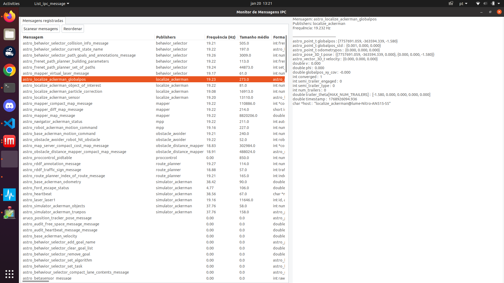

# List IPC Message

> **Technical Responsible:** Eduardo P. Abreu

---

**Table of Contents**

- [Functional Specification](#functional-specification)
- [How to Use](#how-to-use)
- [Technical Specification](#technical-specification)

---

> **Module Classification:**  
> 🟦 **Utilities**

---

## Functional Specification

This module displays all available IPC messages in the system. It allows the user to subscribe to any message and view its content, frequency, size and publishers in real time.


---

## How to Use

In a terminal:

```
./list_ipc_message
```

When executed, the module opens a GTK window listing all defined messages.  
Clicking on a message subscribes to it, displaying its contents and publishing frequency on the right-hand side.  
The module attempts to reconstruct each message using its defining struct.
It's recommended to click in "Scanear mensagens" for it to search for messages that are beeing published.

**Example window:**



On the left is the list of defined messages. When a message (e.g., `carmen_localize_ackerman_globalpos`) is selected, the module subscribes to it and displays the received data on the right.

---

### Outputs

The GTK window serves as the primary visual interface.  
Additionally, some messages are printed to the terminal, such as:
- Warnings when struct fields cannot be found.
- Notifications when subscribing or unsubscribing to messages.

---

## Technical Specification

During inicialization, the module scans all files in `carmen/include/carmen/` for any line containing `_NAME`, followed by spaces or tabs.  
Whenever such a line is found, the next word is treated as a potential message name. For example:

```
#define CARMEN_LOCALIZE_ACKERMAN_GLOBALPOS_NAME "carmen_localize_ackerman_globalpos"
```

Each identified name (e.g., carmen_localize_ackerman_globalpos) is added to a set of potential messages.

Periodically (1Hz), the module iterates through this set, verifying which messages are defined.
For each valid message:

- It removes the message from the pending set.

- Creates a struct with information about the message in a hash table (unordered_map).

- Attempts to locate the struct that defines the message.

To find the defining struct, the module searches for the declaration line and then traces backward until it finds a typedef — which may directly define the struct or alias another type, as in:

```
typedef carmen_mapper_map_message carmen_map_server_current_map_name;
```
If an alias is found, the process repeats recursively using the “real name” of the message.
Once the struct declaration is located, its fields are parsed, split into a vector of strings, and stored in the hash table.

After initialization, the GTK window is displayed.
When the user clicks on a message it unsubscribes to the previous one, and subscribes to the new, and show any new messages that are published on the right side of the window.
